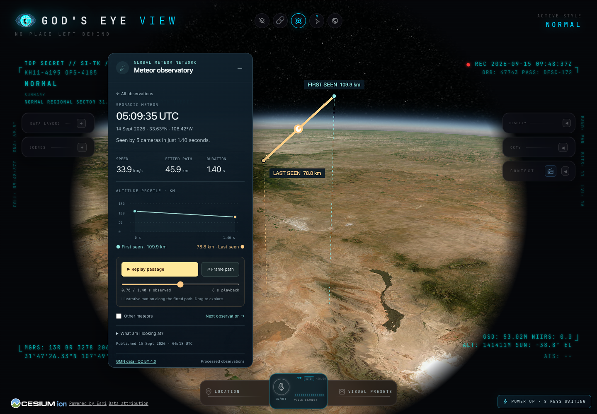

# Meteor trajectories

Enable **DATA LAYERS → Events → Meteors · latest batch**. The observatory opens
with the batch date, actual observation-time distribution and four bright events
to explore. **Explore the brightest meteor** frames an observation; clicking any
visible path also opens it. **All observations** returns to the batch. The header
can collapse the guide without disabling the layer.

The detail view explains the camera observations, shows speed, fitted segment
length and duration, and plots the endpoint altitude profile. A direction arrow,
first/last observation labels and vertical altitude guides put the path in context.
The guides and faint vertical plane reach the WGS84 reference ellipsoid, not the
local terrain: they are altitude references, never extensions toward an impact.
Other meteors are hidden during selection; **Other meteors** shows them muted.
**What am I looking at?** contains the method, station IDs and magnitude.

**Replay passage** illustrates a constant-speed traversal over six seconds with
a luminous head, short trail and observed-time readout. Pause/resume and scrubbing
share the same position. The endpoint is retained after playback; selection changes
and layer teardown remove the head/trail. Continuous rendering stops on pause,
completion and teardown. Playback is not footage or a reconstruction of deceleration.
Navigation does not take the camera away from an actively tracked object.

## Data and interpretation

Source: [Global Meteor Network](https://globalmeteornetwork.org/data/),
[latest trajectory summary](https://globalmeteornetwork.org/data/traj_summary_data/daily/traj_summary_latest_daily.txt).
Licence: [CC BY 4.0](https://creativecommons.org/licenses/by/4.0/).
Field definitions: [GMN documentation](https://globalmeteornetwork.org/data/media/GMN_orbit_data_columns.pdf).
Attribution appears in the card and the application's Data attribution.
Scientific references: Vida et al. (2020), *Estimating trajectories of meteors:
an observational Monte Carlo approach—I. Theory*; Vida et al. (2021), *The Global
Meteor Network—Methodology and first results*, both linked on GMN's data page.

GMN publishes products after processing, reportedly every six hours. The latest
batch can be partial; it is not a guaranteed rolling 24-hour window. Generation
time, actual observation range and local download time are separate fields. A
publication older than 24 hours is stale even if downloaded now. Geographic and
camera coverage are incomplete; an absence of records proves no absence of meteors.

HtBeg/HtEnd are kilometres **above the WGS84 ellipsoid**, not above mean sea level.
The renderer converts to metres once, without a geoid offset, and joins the fitted
endpoints using a straight Cartesian segment (`ArcType.NONE`). It does not clamp
to the ground, extend the path, or infer an impact. No private station locations,
camera footage or invented triangulation rays are included.

At most 2,000 trajectories are displayed, brightest first, then newest, then ID.
The count reports displayed/total when capped. Missing optional speed or magnitude
stays unknown. Invalid/duplicate rows are excluded and counted as degraded data;
a nonempty invalid batch cannot replace a valid one. The fixture is test-only,
attributed CC BY 4.0 data; it is never served as current observations.

## Integration

`src/layers/meteors/` owns parsing, portable acquisition, card and rendering.
Application assembly supplies pointer and render services. The layer starts off;
share token `h` preserves visibility. The two existing voice layer menus accept
`meteors`. Their schema pins change only for this enum addition; no new AI tool,
follow-target contract or analyst-query kind is introduced.

The `/api/meteors` route has one fixed HTTPS upstream, no key or user-supplied query.
Downloads have a 25-second deadline and 64 MiB cap. Concurrent requests share one
refresh; successful data is cached in memory for six hours. Failures back off for
one minute and serve any previous batch as stale. Development and built preview
use the same provider.

## Verification

Parser/provider tests are discovered by `npm test`. With the dev server running,
`node scripts/qa-meteors.mjs` checks the initial overview, live data, WGS84 heights,
click selection, context visibility, endpoint guides, midpoint scrubbing,
replay cancellation, re-enable, mobile bounds and stale retention. Screenshots
are saved in `qa-shots/meteors/`.

## Later

Date/region/shower filters; station lines of sight after verifying public positions
and redistribution terms; original camera observations when accessible; orbital
and radiant views with explicit coordinate frames and epochs.
